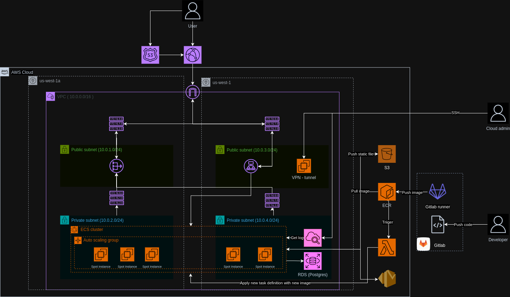

# Terraform AWS ECS Infrastructure



## Overview

This project provides a modular, production-ready Terraform configuration for deploying containerized applications on AWS ECS (Elastic Container Service). It includes best practices for networking, security, scalability, and environment separation.

## Features

- **Modular Design**: Reusable modules for VPC, ALB, ECS, ECR, S3, Security Groups, and Route53/CloudFront.
- **Multi-Environment Support**: Easily manage development, staging, and production environments.
- **Secrets Management**: Store environment variables and secrets securely.
- **SSH Key Management**: Pre-generated SSH keys for secure access.
- **IAM Policies**: Custom IAM policies for CI/CD runners.
- **High-Level Architecture Diagram**: See `data/images/high-level-design.png`.

## Directory Structure

```
ecs/
├── main.tf
├── outputs.tf
├── provider.tf
├── variables.tf
├── runner-iam-policy.json
├── data/
│   ├── services.json
│   ├── images/
│   │   └── high-level-design.png
│   ├── secrets/
│   │   ├── common.env
│   │   ├── example.env
│   │   ├── development/
│   │   ├── production/
│   │   └── staging/
│   └── ssh/
│       ├── id_ed25519
│       └── id_ed25519.pub
├── modules/
    ├── alb/
    ├── ecr/
    ├── ecs/
    │   └── ecs-service/
    ├── route53-cloudfront/
    ├── s3/
    ├── sg/
    └── vpc/
```

## Getting Started

### Prerequisites

- [Terraform](https://www.terraform.io/downloads.html) >= 1.0
- AWS CLI configured with appropriate credentials

### Usage

1. **Clone the repository:**
   ```bash
   git clone <your-repo-url>
   cd infrastructures/ecs
   ```

2. **Initialize Terraform:**
   ```bash
   terraform init
   ```

3. **Select or create your environment variables:**
   - Edit files in `data/secrets/<environment>/` as needed.

4. **Plan the deployment:**
   ```bash
   terraform plan -var-file="variables.tf"
   ```

5. **Apply the deployment:**
   ```bash
   terraform apply -var-file="variables.tf"
   ```

### Makefile Example

You can automate common tasks with a simple Makefile:

```makefile
init:
	terraform init

plan:
	terraform plan -var-file="variables.tf"

apply:
	terraform apply -var-file="variables.tf"

destroy:
	terraform destroy -var-file="variables.tf"
```

## Operations

- **Update secrets:** Edit the relevant `.env` files in `data/secrets/`.
- **Rotate SSH keys:** Replace files in `data/ssh/`.
- **Add new services:** Update `data/services.json` and relevant module configurations.
- **Monitor resources:** Use AWS Console or CLI for ECS, ALB, and CloudWatch.

## Security & Best Practices

- Store secrets securely and restrict access.
- Use separate AWS accounts or roles for each environment.
- Regularly rotate IAM keys and SSH keys.
- Review and restrict IAM policies in `runner-iam-policy.json`.

## Author

This eks infrastructure automation is maintained by me. For questions or support, please contact:

- Name: [Hieu la](mailto:hrcp.hieu@gmail.com)
- GitHub: [@hieula198](https://github.com/hieula198)

Last updated: 07/2025

