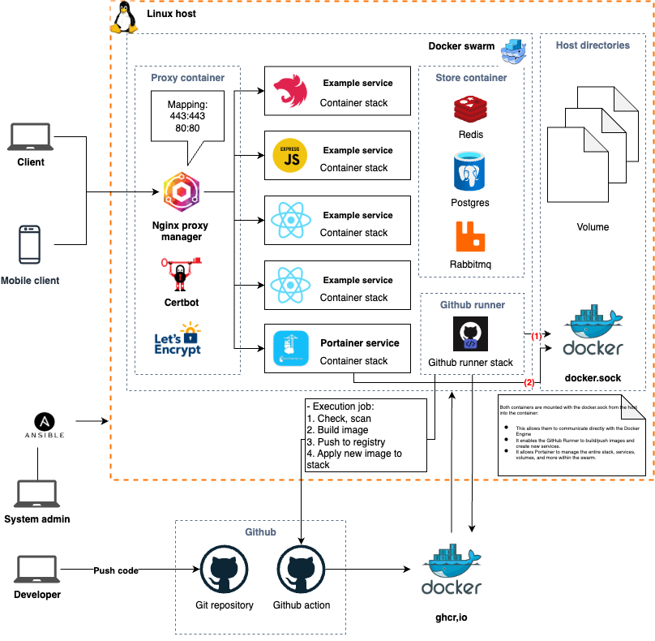

# On-Premise Infrastructure

This repository contains Ansible automation for deploying and managing our on-premise infrastructure as shown below:



## Overview

This project provides infrastructure-as-code capabilities for our on-premise deployments. The infrastructure is managed through Ansible playbooks and can be deployed to staging or production environments.

## Prerequisites

- Python 3.x
- SSH client
- Access permissions to target servers
- Git

## Getting Started

1. Clone this repository:
   ```bash
   git clone <repository-url>
   cd infrastructures/on-premise
   ```

2. Install Ansible:
   ```bash
   make install
   ```

3. Generate SSH key (if not already done):
   ```bash
   make gen-ssh-key
   ```

4. Run the playbook against your desired environment:
   ```bash
   make apply INVENTORY=staging
   # or
   make apply INVENTORY=production
   ```

5. Alternatively, run all steps at once:
   ```bash
   make all
   ```

## Playbook Summary

The `playbook.yml` includes tasks for:

- Server provisioning and configuration
- Network setup and security hardening
- Application deployment
- Database installation and configuration
- Monitoring setup
- Backup configuration

## Available Make Commands

| Command | Description |
|---------|-------------|
| `make install` | Install Ansible via pip |
| `make gen-ssh-key` | Generate SSH key if it doesn't exist |
| `make apply INVENTORY=staging\|production` | Run Ansible playbook with specified inventory |
| `make all` | Run all steps: install, generate key, and apply |

## Directory Structure

- `inventory/` - Contains server inventories for different environments
- `keys/` - Contains SSH keys for server authentication
- `playbook.yml` - Main Ansible playbook
- `images/` - Documentation images and diagrams

## Troubleshooting

If you encounter issues:
1. Verify your SSH key has been generated correctly
2. Confirm your inventory file has the correct server information
3. Check that you have network access to the target servers

For additional support, please contact me or create issue.


## Author

This on-premise infrastructure automation is maintained by me. For questions or support, please contact:

- Name: [Hieu la](mailto:hrcp.hieu@gmail.com)
- GitHub: [@hieula198](https://github.com/hieula198)

Last updated: 07/2025